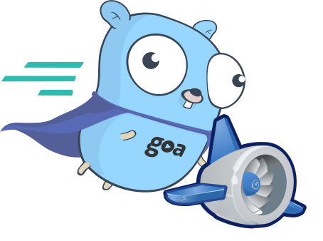

# gaegoasample
A sample code on how to to create an API service on Google App Engine from scratch with the goa v2 framework.

- Deploy: `goapp deploy -application <YOUR-APP-ID> servicea/app.yaml`
- Sample: https://shihan-gae-goa.appspot.com/api/info

